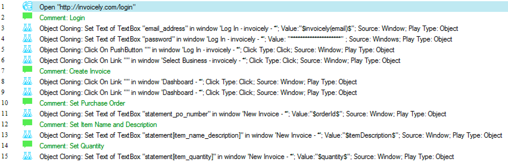
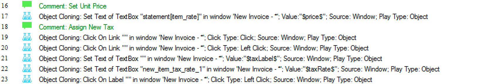
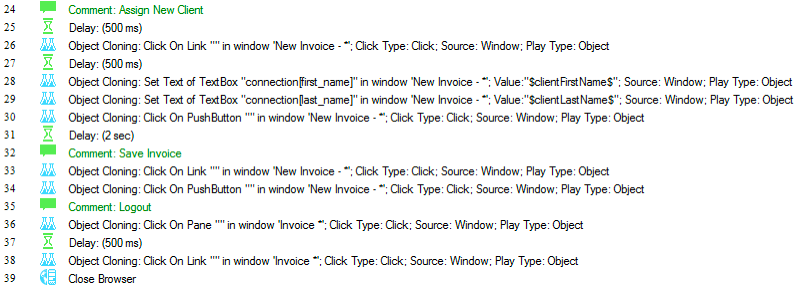
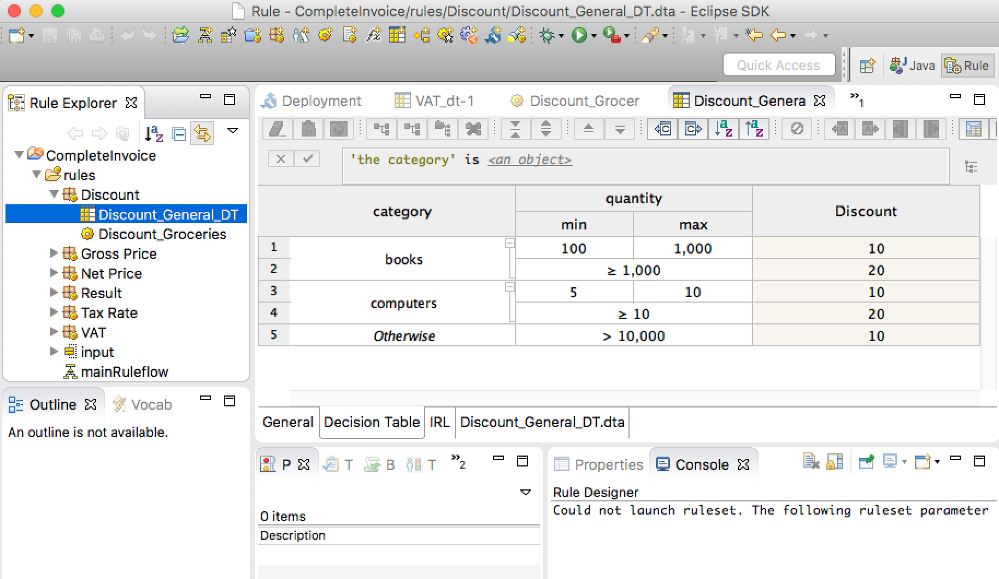
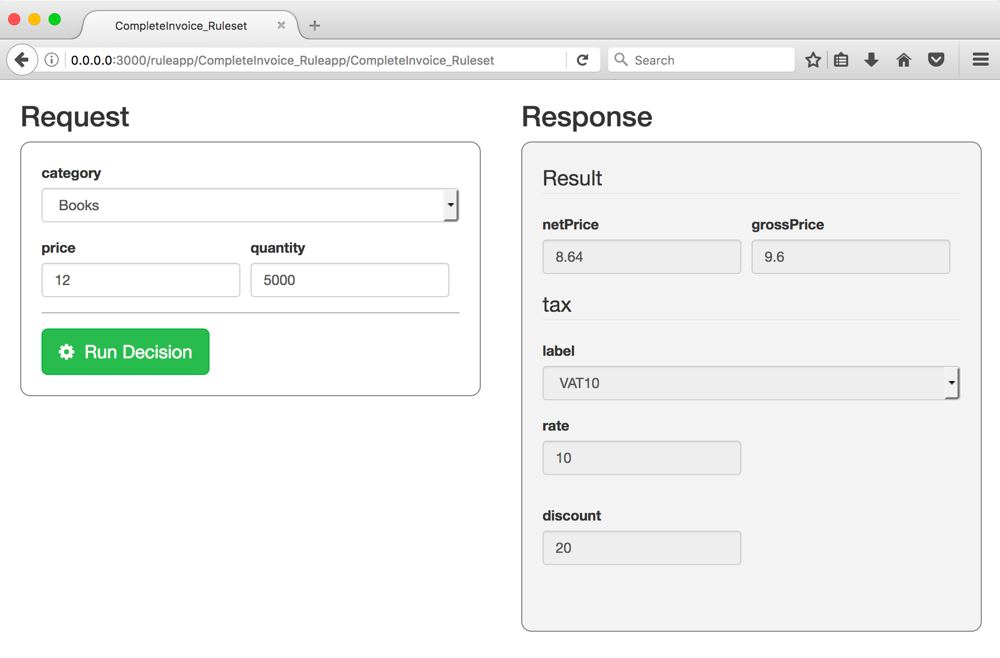
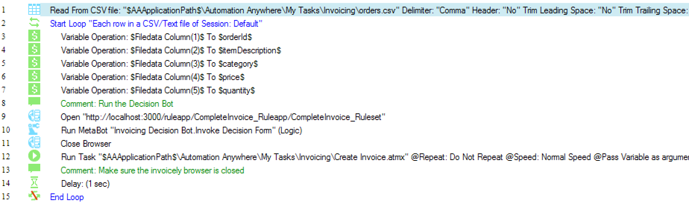

# ODM RPA Invoicing sample

This sample shows how to invoke IBM ODM from IBM RPA with Automation Anywhere through a simple Decision Bot.

## Table of Contents

  - [Before you begin](#before-you-begin)
     - [Required software](#required-software)
     - [Create an Invoicely account](#create-an-invoicely-account)
     - [Create a Credential vault in your Automation Anywhere Control Room](#create-a-credential-vault-in-your-automation-anywhere-control-room)
     - [Copy sample RPA assets to your Automation Anywhere installation](#copy-sample-rpa-assets-to-your-automation-anywhere-installation)
     - [Import the sample Decision Service in Rule Designer](#import-the-sample-decision-service-in-rule-designer)
  - [Scenario](#scenario)
  - [Automating invoice creation with RPA](#automating-invoice-creation-with-rpa)
     - [Creating the Invoice](#creating-the-invoice)
     - [Main Loop](#main-loop)
     - [Running the sample](#running-the-sample)
  - [Full automation with RPA and ODM](#full-automation-with-rpa-and-odm)
     - [Create a Decision Service with extended business logic and Deploy](#create-a-decision-service-with-extended-business-logic-and-deploy)
     - [Deploying a Decision Form](#deploying-a-decision-form)
     - [Invoke the Decision From from an RPA MetaBot](#invoke-the-decision-from-from-an-rpa-metabot)
     - [Invoke the Decision MetaBot from the Main RPA task](#invoke-the-decision-metabot-from-the-main-rpa-task)
     - [Running the sample](#running-the-sample)
  - [One step further: decision governance](#one-step-further-decision-governance)
  - [Useful Links](#useful-links)

---

## Before you begin

All RPA bots and ODM Decision Service described in this sample can be downloaded from the
 [assets/aa](./assets/aa) directory.

### Required software

Here are the software you need to install in order to run the sample:

* [IBM Robotic Process Automation with Automation Anywhere](https://www.ibm.com/cloud-computing/products/digital-process-automation/robotic-process-automation/) (IBM RPA)  leverages ODM to make it possible to automate desktop tasks that involve human judgements that can be captured as ODM decisions.
* [IBM Operational Decision Manager](http://www-03.ibm.com/software/products/en/odm) (ODM) provides a complete, easy-to-use system for automating day-to-day operational decisions and allows business people and IT staff to collaborate on business rules by using an interface and a language that are comfortable and intuitive for both.
* [NodeJS](https://nodejs.org/en/download/) 8.x or greater: needed to run the npm package below
* [ODM Decision Forms](https://www.npmjs.com/package/odm-decision-forms): an open source npm package provided by the ODM development team, 
that generates a form on top of a Decision Service.

### Create an Invoicely account

Go to [invoicely.com](https://invoicely.com) and create an account

### Create a Credential vault in your Automation Anywhere Control Room

* Log in to Control Room
* Go to the *Credential Manager* tab
* Click *Add Credential*
* Name it **invoicing**
* Add the following attributes, with their corresponding values:
   * **email**: email you used to create your Invoicely account.
   * **password**: password for your account

### Copy sample RPA assets to your Automation Anywhere installation

Copy the content of the [assets/aa](./assets/aa) directory to your Automation Anywhere client 
document directory. 
Typically, the .atmx and .csv files should end up in a directory of the form  
`C:\Users\Administrator\Documents\Automation Anywhere Files\Automation Anywhere\My Tasks\Invoicing`
 and the metabot in a `C:\Users\Administrator\Documents\Automation Anywhere Files\Automation Anywhere\My MetaBots` directory.

### Import the sample Decision Service in Rule Designer

* Download [CompleteInvoice.zip](./assets/odm/CompleteInvoice.zip) decision service
* Open Rule Designer
* Import the downloaded zip in your workspace with *File > Import > Archive file*

## Scenario

**Bea** works for *Acme Retail*, a small retailing company selling books, newspapers, computers, groceries and clothing.

**Jack** is a client of *Acme Retail*. Each week, he orders a list of goods to Bea, sending her 
<a target="_blank" href="./assets/aa/orders.csv">a CSV file </a> listing the quantity, category and unit price of each 
item she wants to order.

</img>

**Bea** uses [invoicely.com](invoicely.com) to register invoices corresponding to **Jack**'s orders.

Depending on the quantity and type of goods, **Bea** applies a tax rate and a discount to each row in the orders CSV
and saves the result in her [invoicely.com](invoicely.com) account.

</img>

**Abu** is an IT consultant working for *Acme Retail*. **Bea** asks him to automate the invoicing process as much as possible while 
letting her define discounts and taxes on order items.

We show here how **Abu** can leverage IBM RPA with Automation Anywhere to automate the reading and editing of invoices 
and IBM ODM to compute the discounts and taxes of each order item.

## Automating invoice creation with RPA

Our first step consists of recording an Automation Anywhere task that reads the CSV file, and, for each row, connects 
to [invoicely.com](http://invoicely.com) and create the corresponding invoice.

Since the tax rate and discounted price are not present in the CSV, the RPA task will prompt **Bea** during the process 
to let her enter those values.

*Note*: the RPA bots described in this section are provided in the [assets](./assets) directory. See instructions [here](#before-you-begin).

### Creating the Invoice

The [Create Invoice.atmx](./assets/aa/Invoicing/My%20Tasks/Create%20Invoice.atmx) task creates an invoice in Invoicely, given
a unit price, a quantity, an order id, an item description, a tax rate, and a client first name and last name.

1. Login, create Invoice, set order ID, description and quantity

    

2. Set tax and unit price

    

    Notice that the tax and unit price are not part of the orders CSV and their computation may not be straightforward, 
depending on the order items.

3. Set client information, save and logout

    

### Main Loop

The [Main.atmx](./assets/aa/My%20Tasks/Invoicing/Main.atmx) task does the following:
* Opens orders CSV file
* For each row
   * Prompt the user with the tax rate and discounted price
   
        </img> </img>
   
   * Invoke the invoice creation task.

Here is the complete task:


### Running the sample

From the Automation Anywhere Client, simply run `%AA_INSTALL%\Automation Anywhere\My Tasks\Invoicing\Main.atmx`

## Full automation with RPA and ODM

Automation would be complete if we can avoid asking **Bea** to manually enter the tax rate and discounted price for each
order.

This is where IBM ODM will provide agility and enable the bot to handle more complex business logic than it could before 
in an easy to use format of decision tables or natural language rules.

*Note*: the RPA bots and decision service described in this section are provided in the [assets](./assets) directory. See instructions [here](#before-you-begin).

### Create a Decision Service with extended business logic and Deploy

In ODM, we create a [Decision Service](./assets/odm/CompleteInvoice.zip) that takes a category, price and quantity as input, 
and returns a discounted unit price and a tax rate and label.



This Decision Service is made of:

   * A decision table that determines a VAT from the product category
   
   </img>

   * A decision table that determines a discount from the product quantity and category
   
   </img>
   
   * A specific rule that sets a discount when the product category is 'grocery'

   </img>

Once you have downloaded the [decision service](./assets/odm/CompleteInvoice.zip), open it in ODM Rule Designer, and deploy 
it to your local Rule Execution Server.

</img>

### Deploying a Decision Form

A Decision Form is an auto-generated form allowing to execute a Decision Service. Once this form is 
generated, we will write an RPA MetaBot to invoke it and get the tax and discounted price for each 
order.

You now need to install and run the [odm-decision-forms](https://www.npmjs.com/package/odm-decision-forms) npm package, 
which will provide you with a generated form to invoke the decision service.

Make sure you have [NodeJS](https://nodejs.org/en/download/) 8.x or greater installed:

```bash
node --version
```

Install the *odm-decision-forms* npm package:

```bash
npm install -g odm-decision-forms
```

Run the *odm-decision-forms* server:

```bash
odm-decision-forms --decisionservice http://localhost:9090/DecisionService --console http://localhost:9090/res
```

*Note:* we assume that your ODM server is running at http://localhost:9090. You can change it to fit your installation.

Then open the following URL: [http://localhost:3000/ruleapp/CompleteInvoice_Ruleapp/CompleteInvoice_Ruleset](http://localhost:3000/ruleapp/CompleteInvoice_Ruleapp/CompleteInvoice_Ruleset)

Test the form by entering some input values and hit *Run Decision*.
You should get the following result:



*Tip*: you can see the list of generated forms for each deployed ruleset at [http://localhost:3000](http://localhost:3000)

### Invoke the Decision From from an RPA MetaBot

We then create a [MetaBot](./assets/aa//My%20MetaBots/Invoicing%20Decision%20Bot.mbot) that will enter input data in the Decision Form,
 run the Decision Service, and get the results back as output parameters.


### Invoke the Decision MetaBot from the Main RPA task

Finally, we can amend our [main task](./assets/aa//My%20Tasks/Invoicing/Main%20with%20ODM%20metabot.atmx) calling
ODM instead of prompting the user.
The invocation of the MetaBot consists of mapping the task variables to/from input/output parameters of the MetaBot.



### Running the sample

From the Automation Anywhere Client, simply run `%AA_INSTALL%\Automation Anywhere\My Tasks\aa\Main with ODM metabot.atmx`

You can see a live demo of the running bot here: https://youtu.be/Z9QIBERy3k8

## One step further: decision governance

Once the RPA tasks are ready and the decision bot is functional, you may publish your Decision Service 
to [ODM Decision Center](https://www.ibm.com/support/knowledgecenter/en/SSQP76_8.9.0/com.ibm.odm.dcenter/topics/odm_dcenter.html) 
in order to take advantage of its governance capabilities such as user permission, release management and testing.

</img>

Should a discount or a tax need to be changed, **Bea** can simply connect to Decision Center and edit the corresponding rule or
decision table.

</img>

Each time a new version of the Decision Service is ready, either **Abu** or **Bea** can redeploy it to Rule Execution Server without 
having to change anything to the RPA tasks.

</img>

This way, we have complete decoupling of the lifecycle and ownership of the decision logic from the RPA task authoring.

## Useful Links

* [IBM Robotic Process Automation with Automation Anywhere](https://developer.ibm.com/bpm/docs/ibm-robotic-process-automation-automation-anywhere/): 
main portal for IBM RPA with Automation Anywhere and IBM BPM / ODM integration scenarios.
* [Using ODM to make a decision within an RPA activity](https://git.ng.bluemix.net/aswapnil/odm-rpa-integration-samples/blob/master/docs/odm-decisions-in-rpa): 
a sample describing how to invoke ODM from RPA through a ['JSON' metabot](https://git.ng.bluemix.net/IBMBPMCommunity/rpa-IntegrationSamples/blob/master/assets/metabots/JSON.mbot). 
* [Automation Anywhere and IBM ODM](https://www.linkedin.com/pulse/automation-anywhere-ibm-odm-neil-kolban): a tutorial video 
from [Neil Kolban](https://www.linkedin.com/in/kolban/) (Salient Process) showing how to fill in an Excel spreadsheet from Automation Anywhere, requesting values from IBM ODM through a SOAP call

# Issues and contributions
For issues relating to this sample, please use the [GitHub issue tracker](../../issues).
We welcome contributions following [our guidelines](CONTRIBUTING.md).

# License
The source files found in this project are licensed under the [Apache License 2.0](LICENSE).

# Notice
© Copyright IBM Corporation 2017.

