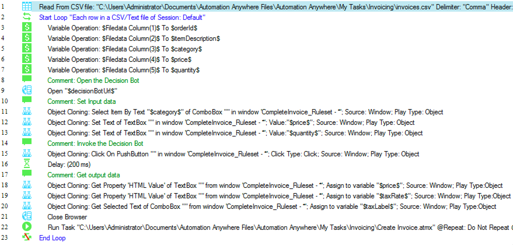

# ODM RPA Invoicing sample

This sample shows how to invoke IBM ODM from IBM RPA with Automation Anywhere through a simple Decision Bot.

## Table of Contents

  - [Before you begin](#before-you-begin)
     - [Required software](#required-software)
     - [Create an Invoicely account](#create-an-invoicely-account)
     - [Create a Credential vault in IBM RPA Control Room](#create-a-credential-vault-in-ibm-rpa-control-room)
     - [Copy sample assets to your IBM RPA installation](#copy-sample-assets-to-your-ibm-rpa-installation)
  - [Scenario](#scenario)
  - [Automating invoice creation with IBM RPA](#automating-invoice-creation-with-ibm-rpa)
     - [Creating the Invoice](#creating-the-invoice)
     - [Main Loop](#main-loop)
     - [Running the sample](#running-the-sample)
  - [Full automation with IBM RPA + IBM ODM](#full-automation-with-ibm-rpa-ibm-odm)
     - [Create and deploy a Decision Service](#create-and-deploy-a-decision-service)
     - [Deploying a Decision Bot](#deploying-a-decision-bot)
     - [Invoke the Decision Bot from RPA](#invoke-the-decision-bot-from-rpa)
     - [Running the sample](#running-the-sample)
  - [One step further: decision governance](#one-step-further-decision-governance)
  - [Useful Links](#useful-links)

---

## Before you begin

### Required software

Here are the software you need to install in order to run the sample:

* [IBM Robotic Process Automation with Automation Anywhere](https://www.ibm.com/cloud-computing/products/digital-process-automation/robotic-process-automation/) (IBM RPA)  leverages ODM to make it possible to automate desktop tasks that involve human judgements that can be captured as ODM decisions.
* [IBM Operational Decision Manager](http://www-03.ibm.com/software/products/en/odm) (ODM) provides a complete, easy-to-use system for automating day-to-day operational decisions and allows business people and IT staff to collaborate on business rules by using an interface and a language that are comfortable and intuitive for both.
* [NodeJS](https://nodejs.org/en/download/): needed to run the npm package below
* [ODM Decision Forms](https://www.npmjs.com/package/odm-decision-forms): an open source npm package provided by the ODM development team, 
that generates a form on top of a Decision Service.

### Create an Invoicely account

Go to [invoicely.com](https://invoicely.com) and create an account

### Create a Credential vault in IBM RPA Control Room

* Log in to Control Room
* Go to the *Credential Manager* tab
* Click *Add Credential*
* Name it **invoicing**
* Add the following attributes, with their corresponding values:
   * **email**: email you used to create your Invoicely account.
   * **password**: password for your account

### Copy sample assets to your IBM RPA installation

Copy the directory [assets/aa](./assets/aa) to your Automation Anywhere client installation, typically 
`C:\Users\Administrator\Documents\Automation Anywhere Files\Automation Anywhere\My Tasks`

## Scenario

Jack works for Acme Retail, a small retailing company selling books, newspapers, computers, groceries and clothing.

Andrea is a client of Acme Retail. Each week, she orders a list of goods to Jack, sending him 
<a target="_blank" href="./assets/aa/orders.csv">a CSV file </a> listing the quantity, category and unit price of each 
item she wants to order.

</img>

Jack uses [invoicely.com](invoicely.com) to register invoices corresponding to Andrea's orders.

Depending on the quantity and type of goods, he applies a tax rate and a discount to each row in the orders CSV
and saves the result in his invoicely account.

</img>

## Automating invoice creation with IBM RPA

Our first step consists of recording an Automation Anywhere task that reads the CSV file, and, for each row, connects 
to [invoicely.com](http://invoicely.com) and create the corresponding invoice.

Since the tax rate and discounted price are not present in the CSV, we prompt the user during the process in order to get those values.

### Creating the Invoice

The [Create Invoice.atmx](./assets/aa/Create%20Invoice.atmx) task creates an invoice in Invoicely, given
a unit price, a quantity, an order id, an item description, a tax rate, and a client first name and last name.

1. Login, create Invoice, set order ID, description and quantity

    

2. Set tax and unit price

    

3. Set client information, save and logout

    

### Main Loop

The [Main.atmx](./assets/aa/Main.atmx) task does the following:
* Opens orders CSV file
* For each row
   * Prompt the user with the tax rate and discounted price
   
        </img> </img>
   
   * Invoke the invoice creation task.

Here is the complete task:


### Running the sample

From the Automation Anywhere Client, simply run `%AA_INSTALL%\Automation Anywhere\My Tasks\aa\Main.atmx`

## Full automation with IBM RPA + IBM ODM

Automation would be complete if we can avoid prompting the user with the tax rate and discounted price.
This is where IBM ODM will come in handy.

### Create and deploy a Decision Service

In ODM, we create a [Decision Service](./assets/odm/CompleteInvoice.zip) that takes a category, price and quantity as input, 
and returns a discounted unit price and a tax rate and label.


This Decision Service is made of:

   * A decision table that determines a VAT from the product category
   
   </img>

   * A decision table that determines a discount from the product quantity and category
   
   </img>
   
   * A specific rule that sets a discount when the product category is 'grocery'

   </img>

Once you have downloaded the [decision service](./assets/CompleteInvoice.zip), open it in ODM Rule Designer, and deploy 
it to your local Rule Execution Server.

</img>

### Deploying a Decision Bot

A Decision Bot is an auto-generated form allowing to execute a Decision Service. Once this form is 
generated, we will write an IBM RPA task to invoke it and get the tax and discounted price for each 
order.

You now need to install and run the [odm-decision-forms](https://www.npmjs.com/package/odm-decision-forms) npm package, 
which will provide you with a generated form to invoke the decision service.

```bash
npm install -g odm-decision-forms
odm-decision-forms --decisionservice http://localhost:9090/DecisionService --console http://localhost:9090/res
```

*Note:* we assume that your ODM server is running at http://localhost:9090. You can change it to fit your installation.

Then open the following URL: [http://0.0.0.0:3000/ruleapp/CompleteInvoice_Ruleapp/CompleteInvoice_Ruleset](http://0.0.0.0:3000/ruleapp/CompleteInvoice_Ruleapp/CompleteInvoice_Ruleset)

Test the bot by entering some input values and hit *Run Decision*.
You should get the following result:


### Invoke the Decision Bot from RPA

We can now amend our [main loop](./assets/aa/Main%20with%20ODM.atmx). 

Instead of prompting the user, we use standard RPA object cloning to invoke our Decision Bot, passing the quantity, unit 
price and category of each order,  and getting a tax rate, tax label, and discounted price.



### Running the sample

From the Automation Anywhere Client, simply run `%AA_INSTALL%\Automation Anywhere\My Tasks\aa\Main with ODM.atmx`

## One step further: decision governance

Once the RPA tasks are ready, and the decision bot invocation is functional, you may publish your Decision Service 
to [ODM Decision Center](https://www.ibm.com/support/knowledgecenter/en/SSQP76_8.9.0/com.ibm.odm.dcenter/topics/odm_dcenter.html) 
in order to take advantage of its governance capabilities such as user permission, release management and testing.

</img>

Each time a new version of your Decision Service is ready, simply redeploy it to your Rule Execution Server without 
changing anything to the RPA tasks.

</img>

This way, you can completely decouple the lifecycle and ownership of the decision logic from the RPA task authoring.

</img>

## Useful Links

* [IBM Robotic Process Automation with Automation Anywhere](https://developer.ibm.com/bpm/docs/ibm-robotic-process-automation-automation-anywhere/): 
main portal for IBM RPA with Automation Anywhere and IBM BPM / ODM integration scenarios.
* [Using ODM to make a decision within an RPA activity](https://git.ng.bluemix.net/aswapnil/odm-rpa-integration-samples/blob/master/docs/odm-decisions-in-rpa): 
a sample describing how to invoke ODM from RPA through a ['JSON' metabot](https://git.ng.bluemix.net/IBMBPMCommunity/rpa-IntegrationSamples/blob/master/assets/metabots/JSON.mbot). 
* [Automation Anywhere and IBM ODM](https://www.linkedin.com/pulse/automation-anywhere-ibm-odm-neil-kolban): a tutorial video 
from [Neil Kolban](https://www.linkedin.com/in/kolban/) (Salient Process) showing how to fill in an Excel spreadsheet from IBM RPA, requesting values from IBM ODM through a SOAP call

# Issues and contributions
For issues relating to this sample, please use the [GitHub issue tracker](../../issues).
We welcome contributions following [our guidelines](CONTRIBUTING.md).

# License
The source files found in this project are licensed under the [Apache License 2.0](LICENSE).

# Notice
© Copyright IBM Corporation 2017.

